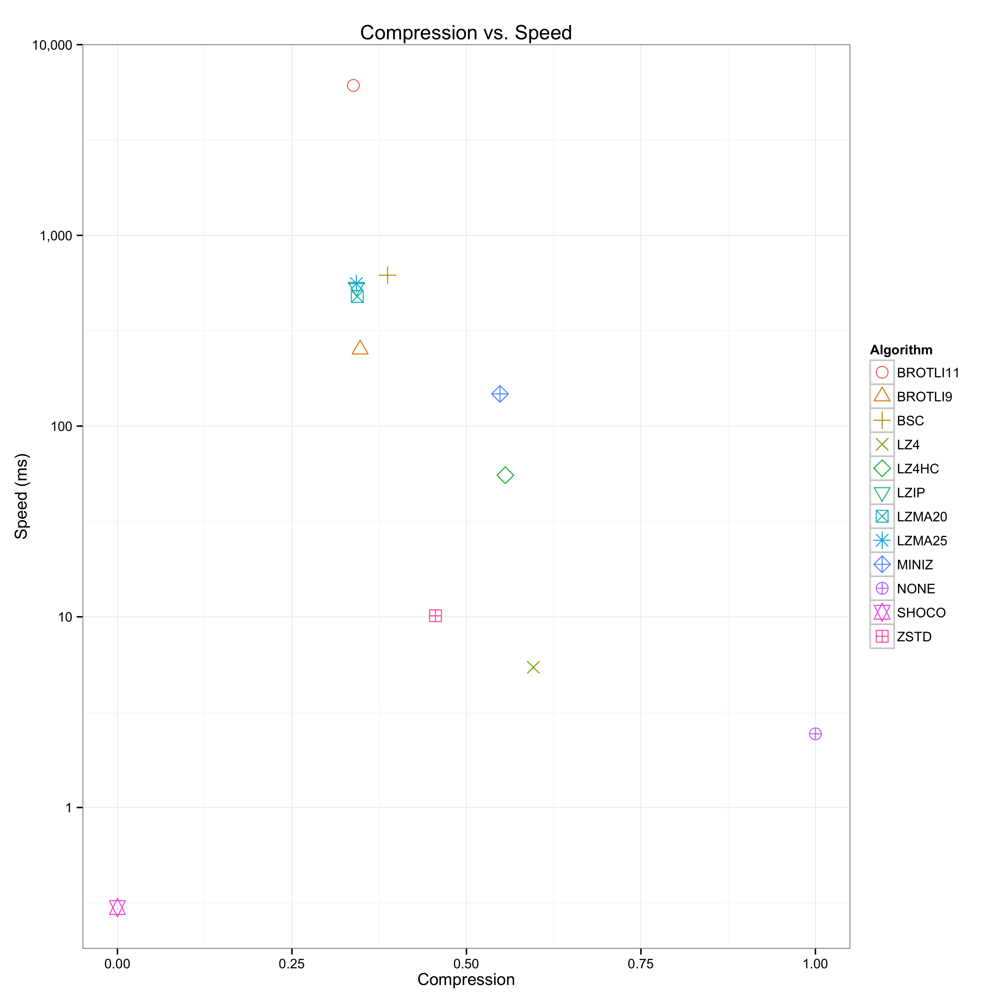
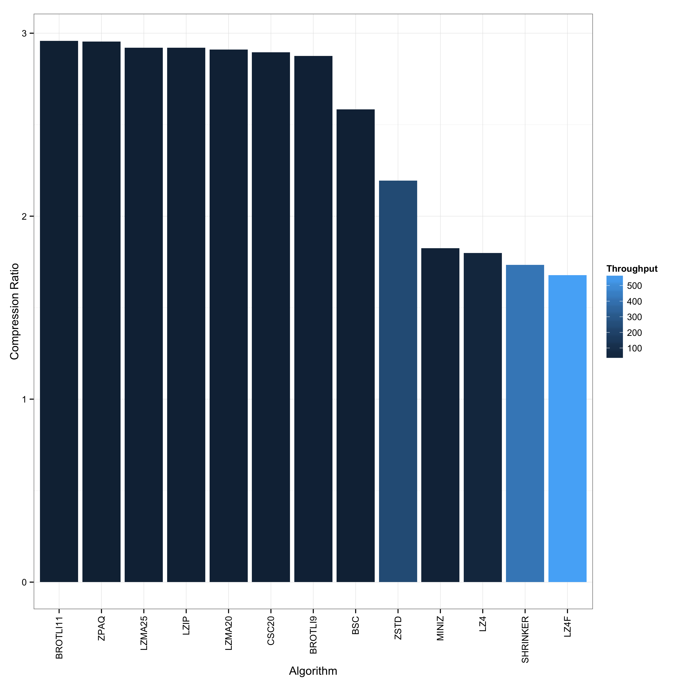

A benchmark utility to examine and compare various compression algorithms,
based on [bundle](https://github.com/r-lyeh/bundle).

### Usage

Clone with `--recursive` and build with `make`. Then run

    ./benchmark < input > log

where `input` is the data you want to run through the various algorithms
Thereafter, generate the plots:

    ./plot < log

You will find several plots in the current directory for your perusal.

### Example

The following examples shows an invocation for a 10,000 packet PCAP trace:

