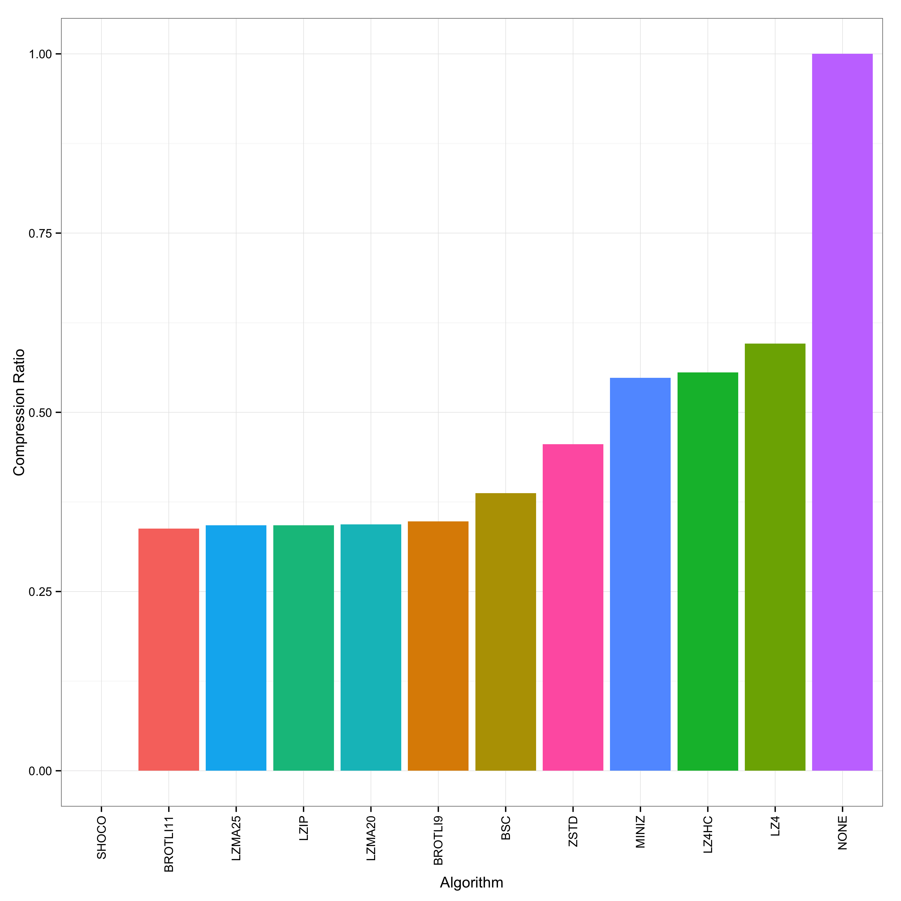
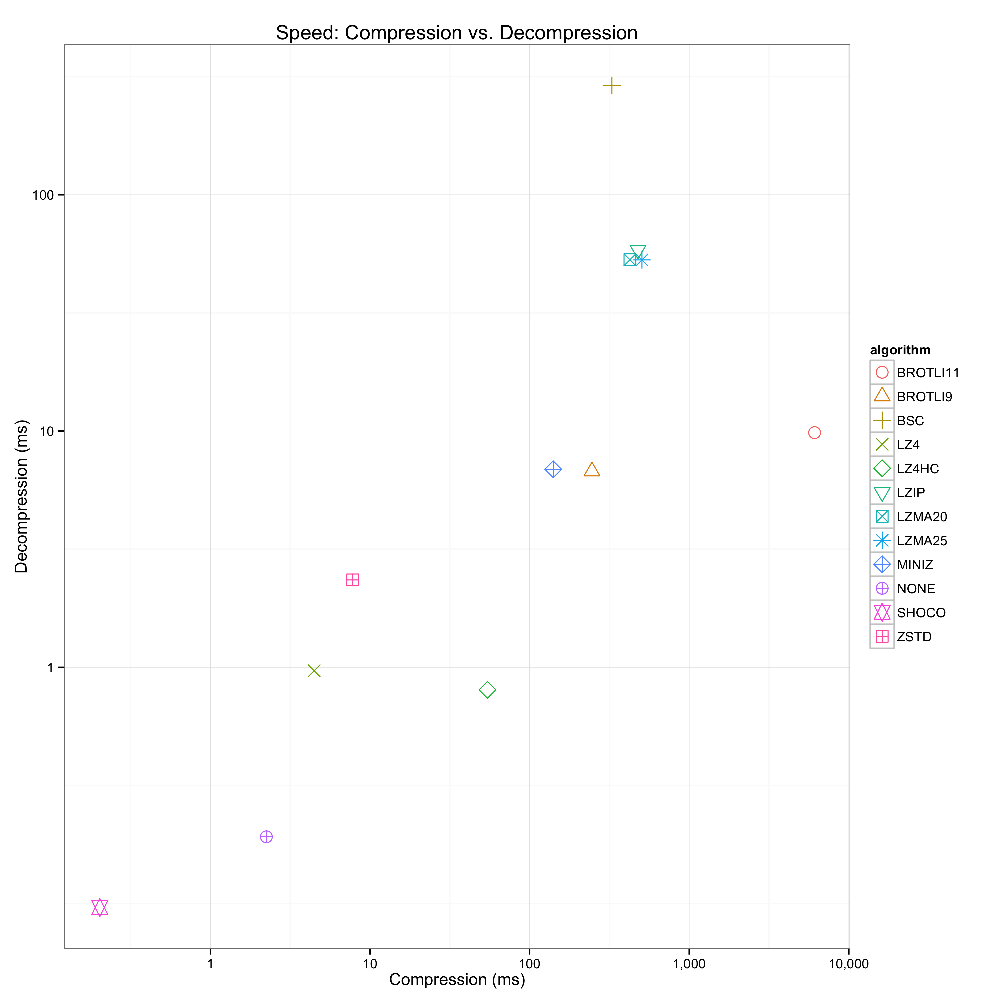
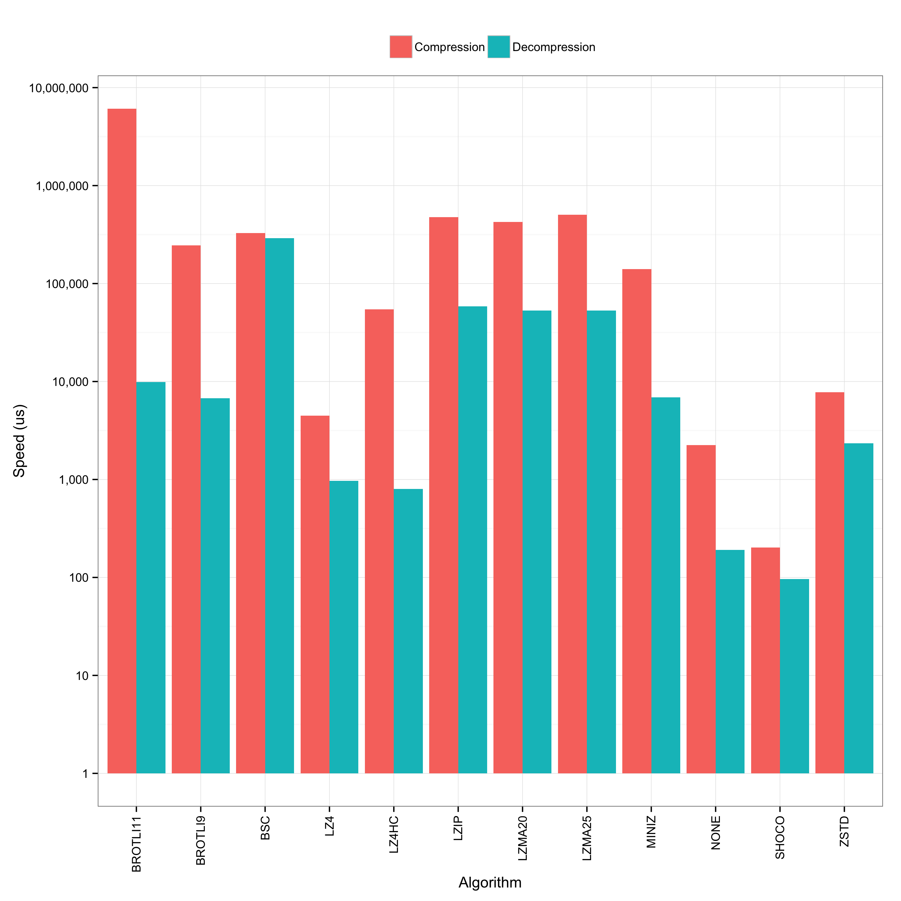

A benchmark utility to examine and compare various compression algorithms.

### Usage

Clone with `--recursive` and build with `make`. Then run as follows:

    ./benchmark < input > log

where `input` is the data you want to run through the compressors.
Thereafter, generate the plots:

    ./plot < log

This generates several PDFs in the current directory for your perusal.

### Example

The following examples shows an example invocation with a 10,000 packets PCAP
trace:

