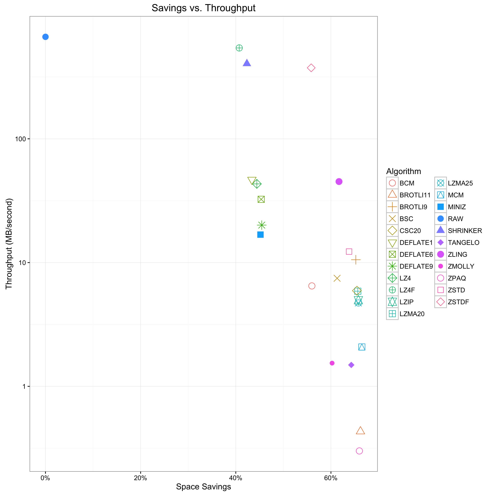
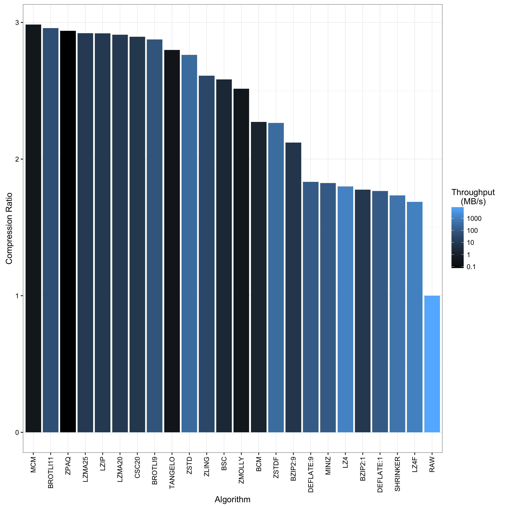
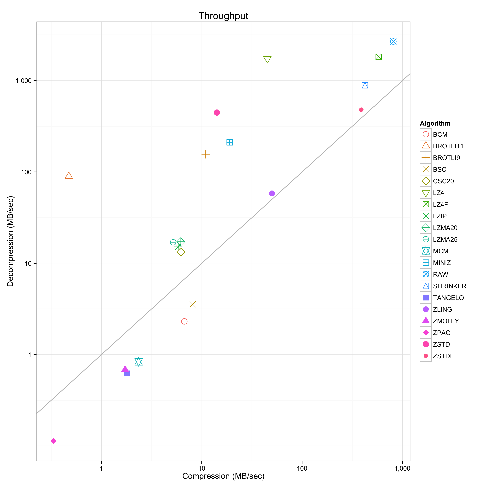
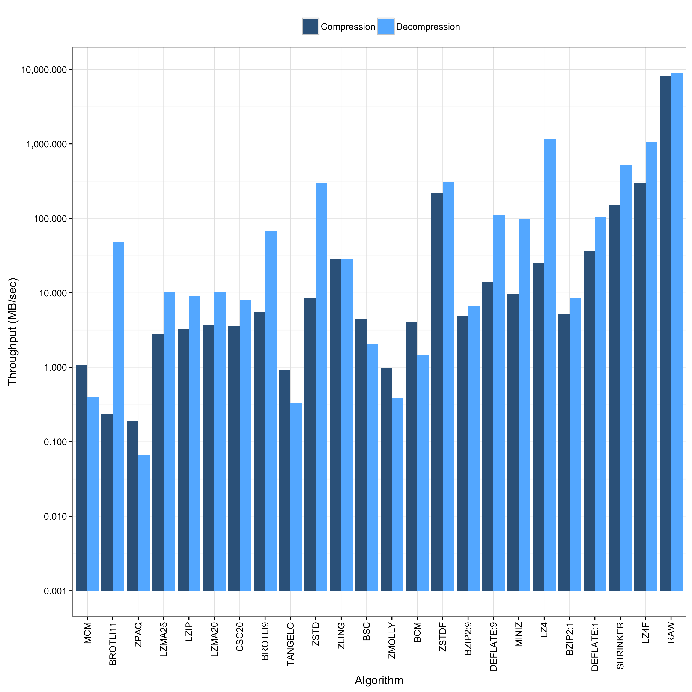
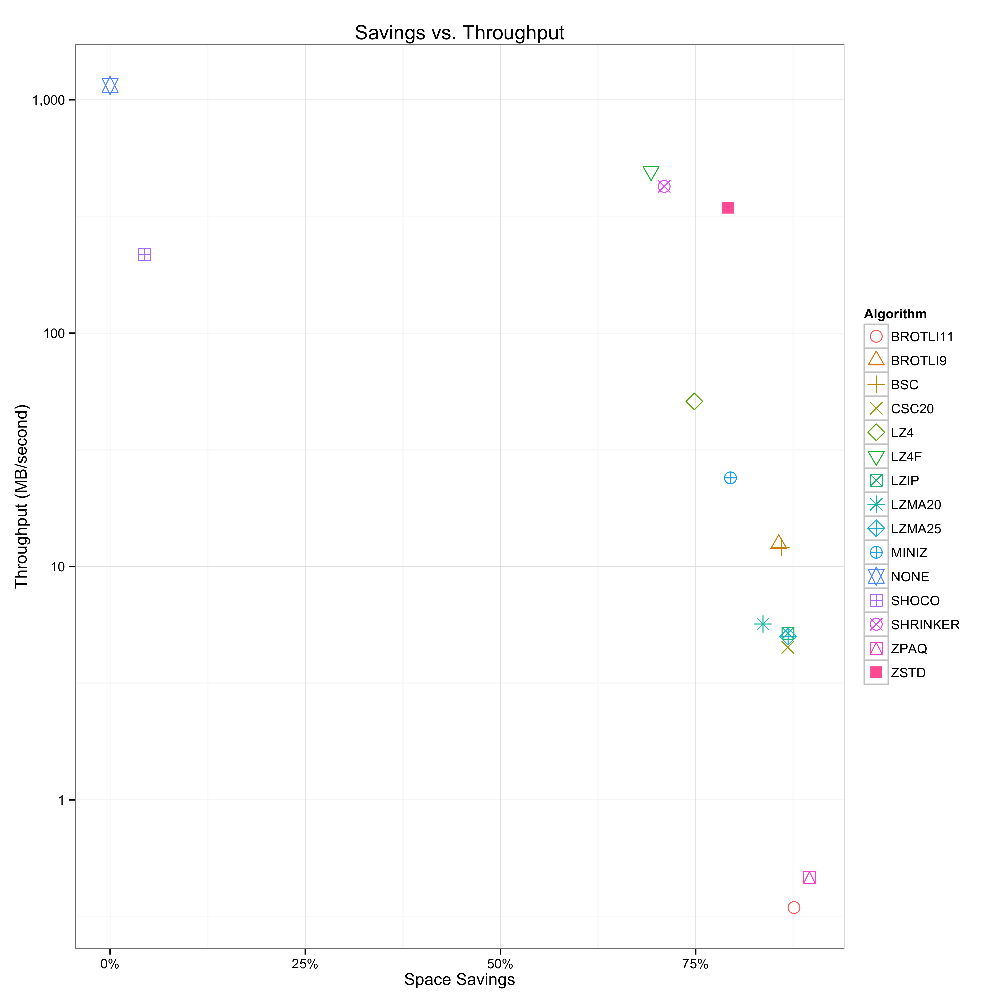
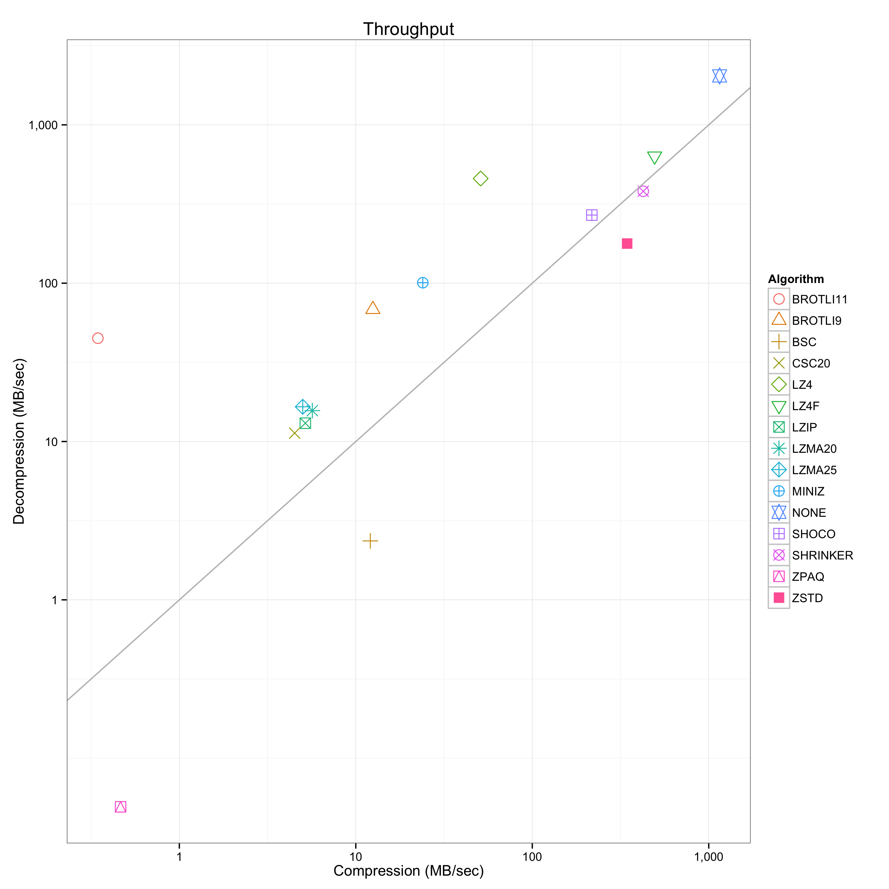
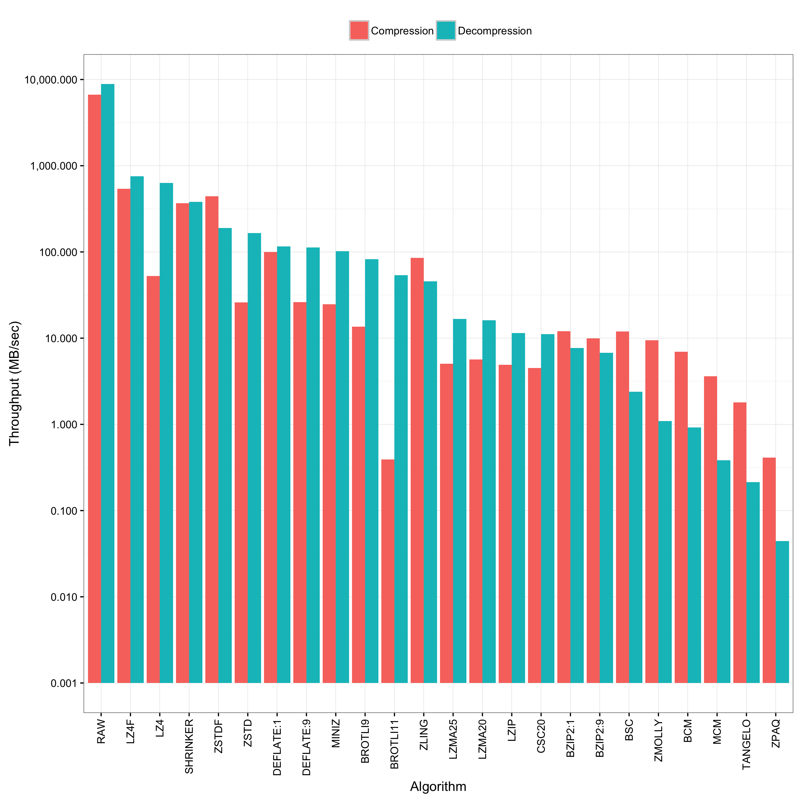

A benchmark utility to examine and compare various compression algorithms,
based on [bundle](https://github.com/r-lyeh/bundle).

### Usage

Clone with `--recursive` and build with `make`. Then run

    ./benchmark < input > log

where `input` is the data you want to run through the various algorithms
Thereafter, generate the plots:

    ./plot [prefix] [format] < log

You will find several plots in the current directory for your perusal. The
optional argument `prefix` sets a file prefix and `format` defaults to `png`.

### Example

The following examples shows an invocation for the 10,000 packets of a PCAP
trace
([2009-M57-day11-18](http://digitalcorpora.org/corpora/scenarios/m57-patents-scenario)):

The above plot shows the trade-off space between space savings and throughput
(decompression in MB/sec). The further a point lays in the top-right corner the
better it performs across both dimensions.

The above plot ranks the compression algorithms with respect to their
compression ratio. The algorithm with the highst compression ratio appears on
the left. The coloring corresponds to the decompression throughput in MB/sec,
highlighting in green those algorithms with fast decompression.

The above plot contrasts compression versus decompression throughput. The
x-axis shows compression and the y-axis decompression performance in MB/sec. A
point above the y=x diagonal means that it has high decompression than
compression throughput. The converse holds for points below the diagonal. The
further a point appears in the top-right corner, the higher its combined
performance. Note that this algorithm does not profile compression ratio.

The above plot shows the same information as the previous plot, but also
includes the compression ratio in that the left-most algorithm exhibits the
highest compression ratio.

The next figures show the same plot types for ASCII [Bro](http://www.bro.org)
logs generated from the above mentioned trace:

### License

The above plots come with a [Creative Commons Attribution 4.0 International
License](http://creativecommons.org/licenses/by/4.0/), while the code ships
with a 3-clause BSD license.
