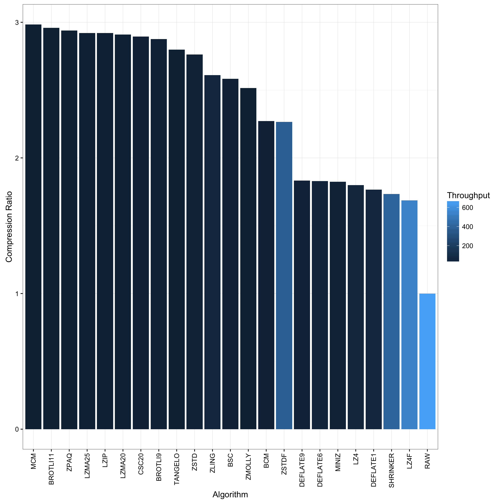
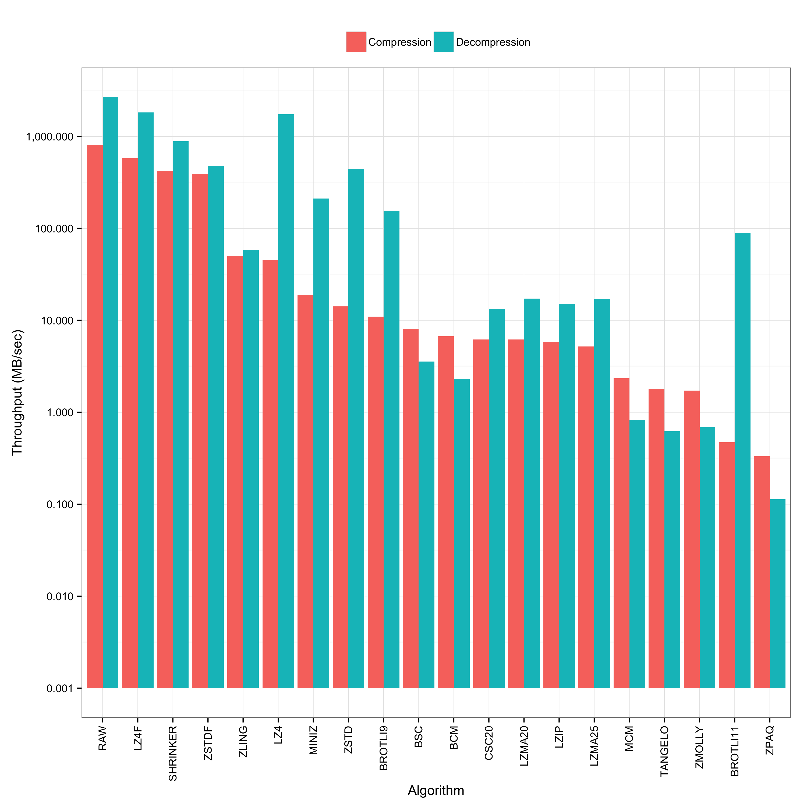
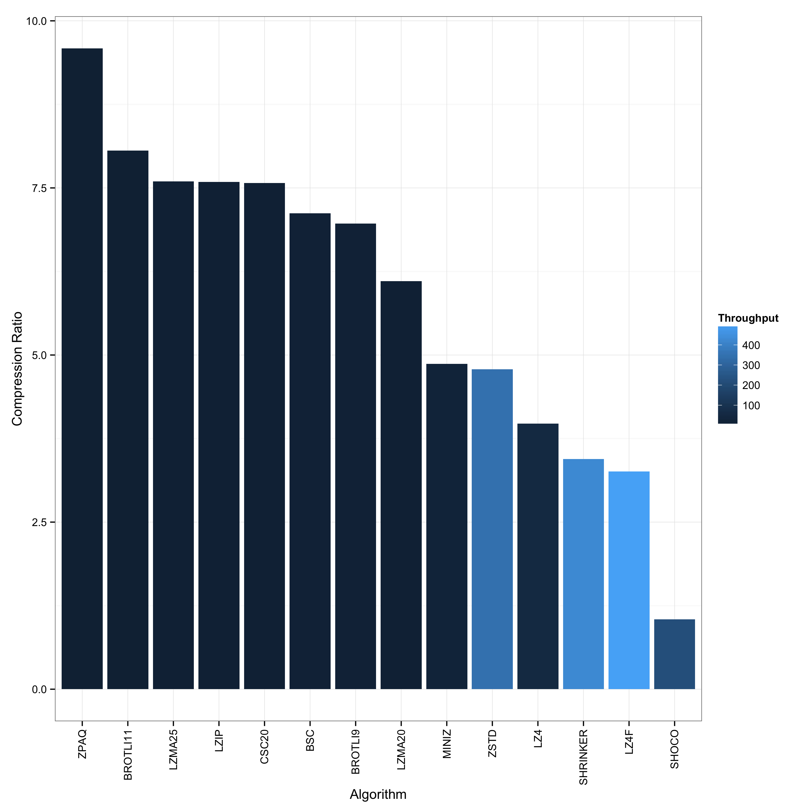
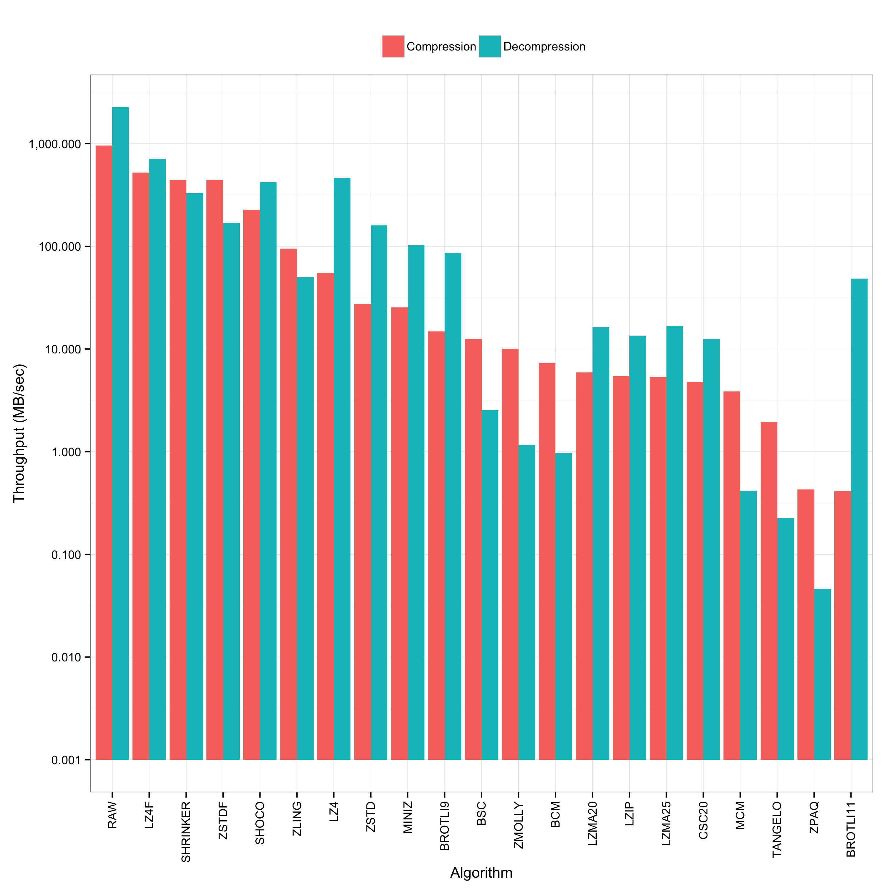

A benchmark utility to examine and compare various compression algorithms,
based on [bundle](https://github.com/r-lyeh/bundle).

### Usage

Clone with `--recursive` and build with `make`. Then run

    ./benchmark < input > log

where `input` is the data you want to run through the various algorithms
Thereafter, generate the plots:

    ./plot < log

You will find several plots in the current directory for your perusal.

### Example

The following examples shows an invocation for the 10,000 packets of a PCAP
trace
([2009-M57-day11-18](http://digitalcorpora.org/corpora/scenarios/m57-patents-scenario)):

The next figures show the same plot types for ASCII [Bro](http://www.bro.org)
logs generated from the above mentioned trace:

Note the presence of SHOCO (which only operates on ASCII data) in the bottom
figures, albeit not very effective in terms of space savings.

### License

The above plots come with a [Creative Commons Attribution 4.0 International
License](http://creativecommons.org/licenses/by/4.0/), while the code ships
with a 3-clause BSD license.
